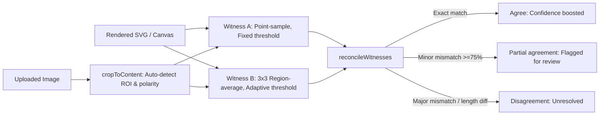

# OCR Dual-Witness Consensus Engine

Single-pass OCR can fail silently on ambiguous characters (e.g., `7` mistaken for `1`) or complex document layouts without providing reliable uncertainty signals. This project implements a **dual-witness consensus pipeline** running two independent, client-side recognition passes on every image. When both passes agree, confidence is boosted; disagreements are flagged for human review.

### Features
1. **7-Segment Meter Reading**: Deterministic pixel-sampling decoder with zero runtime dependencies.
2. **Document & UI OCR**: In-browser text extraction via [Tesseract.js](https://github.com/naptha/tesseract.js) (WebAssembly) with heuristic-driven Markdown layout reconstruction.
3. **100% Client-Side**: No backend server, external API keys, or cloud dependencies.

Inspired by the dual-witness consensus pattern deployed in [Unyna](https://unyna.unyhub.org) for medical meter display verification, reimplemented here from scratch with synthetic sample generators.

---

## Mode 1: Meter Reading (7-Segment Decoder)



Both witnesses scan horizontally across the image to locate digit boundaries and evaluate segment intensity against a 7-segment lookup table, but employ distinct sampling strategies:

| Strategy | Witness A | Witness B |
|---|---|---|
| **Sampling** | Single-pixel point sample at segment center | 3×3 grid average across segment area |
| **Thresholding** | Fixed intensity threshold (`128`) | Adaptive threshold (luminance midpoint per image) |

Single-pixel sampling is fast but sensitive to isolated dead pixels or noise. Region-averaging smooths localized sensor artifacts, while adaptive thresholding handles uneven lighting and high-glare displays.

Consensus logic in [`consensus.ts`](src/lib/consensus.ts) reconciles the outputs:

- **Exact match**: Returns status `agree` with a confidence boost (capped at `0.99`).
- **Partial agreement** ($\ge 75\%$ character overlap): Returns the higher-confidence reading but sets `needsHumanReview: true`.
- **Disagreement** (length mismatch or $< 75\%$ match): Returns `null` consensus and flags for review.

### Image Upload & Auto-Alignment

Uploaded photos lack fixed camera positioning. The upload pipeline applies two preprocessing steps:
1. [`cropToContent.ts`](src/lib/cropToContent.ts): Determines the active display bounding box and polarity (light digits on dark background vs. dark on light).
2. [`decodeDisplayAutoAlign`](src/lib/imageDecoder.ts): Sweeps across candidate scale factors and horizontal offsets to locate optimal digit alignments before decoding.

---

## Mode 2: Document & UI OCR

General text extraction uses [Tesseract.js](https://github.com/naptha/tesseract.js) running client-side in WebAssembly. Two passes evaluate the same image under different page segmentation modes (PSM):

| Strategy | Witness A | Witness B |
|---|---|---|
| **Segmentation** | `AUTO` (Tesseract automatic layout detection) | `SPARSE_TEXT` (Unstructured, scattered text detection) |

On standard single-column text, both modes converge. On complex UI layouts (icons, isolated badges, multi-column cards), the two modes frequently produce differing segmentations.

Because OCR output spans multi-word paragraphs where a single dropped character shifts subsequent indices, [`textConsensus.ts`](src/lib/textConsensus.ts) computes normalized Levenshtein similarity over compared prefixes rather than strict index matching:

- **Similarity == 1.0**: `agree` status with boosted confidence.
- **Similarity $\ge 0.75$**: `partial-agreement`, returns higher confidence witness, flagged for review.
- **Similarity $< 0.75$**: `disagreement`, presents both witness outputs side-by-side.

### Geometric Markdown Reconstruction

Markdown structure is generated by [`formatAsMarkdown.ts`](src/lib/formatAsMarkdown.ts) using line geometry rather than language models:
- Line bounding box height relative to the page median height determines heading levels (`#`, `##`).
- Leading bullet glyphs (`-`, `*`, `•`) map to Markdown list items.
- Consecutive lines separated by small vertical gaps are merged into paragraphs; larger gaps trigger paragraph breaks.

---

## Verification & Test Suite

Sampling strategies, thresholding functions, and consensus reconciliation are pure functions with unit tests covering synthetic edge cases:

```bash
npm run test
```

```
 ✓ src/lib/consensus.test.ts        (8 tests)
 ✓ src/lib/cropToContent.test.ts    (3 tests)
 ✓ src/lib/imageDecoder.test.ts     (10 tests)
 ✓ src/lib/textConsensus.test.ts    (9 tests)
 ✓ src/lib/formatAsMarkdown.test.ts (7 tests)

 Test Files  5 passed (5)
      Tests  37 passed (37)
```

### Key Test Scenarios
- `imageDecoder.test.ts`: Digits 0–9 under both sampling modes, decimal point detection, clean termination on whitespace, zero confidence on blank frames, dimmed-pixel noise immunity test, and auto-align recovery on shifted crops.
- `cropToContent.test.ts`: Light-on-dark, dark-on-light detection, and low-contrast rejection.
- `consensus.test.ts`: Exact match confidence boosting, single-character divergence, length mismatches, and boundary thresholds.
- `textConsensus.test.ts`: Levenshtein similarity validation on matching text, single-typo differences, and dissimilar outputs.
- `formatAsMarkdown.test.ts`: Heading classification thresholds, bullet normalization, paragraph merging, and empty input handling.

### Sample Verification

Benchmarked against procedural test vectors:

| Sample | Ground Truth | Witness A | Witness B | Consensus Result |
|---|---|---|---|---|
| Clean | `42.8` | `42.8` (44% conf.) | `42.8` (63% conf.) | Agree (`42.8`, 73% combined) |
| Glare | `178.2` | `178.2` (56% conf.) | `178.2` (62% conf.) | Agree (`178.2`, 72% combined) |
| Blurry | `905.1` | `905.1` (48% conf.) | `905.1` (58% conf.) | Agree (`905.1`, 68% combined) |

---

## Tech Stack

- **Framework**: Next.js 16 (App Router), React 19, TypeScript
- **Styling**: Tailwind CSS
- **OCR Engine**: [Tesseract.js](https://github.com/naptha/tesseract.js) (WASM, client-side execution)
- **Testing**: Vitest
- **Deployment**: Static build (compatible with any static web host or edge CDN)

---

## Getting Started

```bash
git clone https://github.com/Shuumei/ocr-dual-witness-pipeline.git
cd ocr-dual-witness-pipeline
npm install
npm run dev
```

Open [http://localhost:3000](http://localhost:3000). No environment variables or credentials required.

---

## Architectural Decisions

- **Deterministic In-Browser Execution vs. Cloud APIs**:
  OCR execution runs entirely on the client. This avoids vendor lock-in, eliminates recurring per-call inference costs, removes API authentication complexity, and ensures that sensitive document images never leave the user's browser.
- **Dual-Witness Independence**:
  Using orthogonal sampling and segmentation modes ensures that systematic errors (e.g. localized lens flare or non-standard font kerning) don't produce high-confidence false positives.
- **Rule-Based Layout Inference**:
  Markdown generation uses geometric heuristics derived from bounding boxes instead of probabilistic text rewriting, preserving literal text accuracy without hallucinations.
