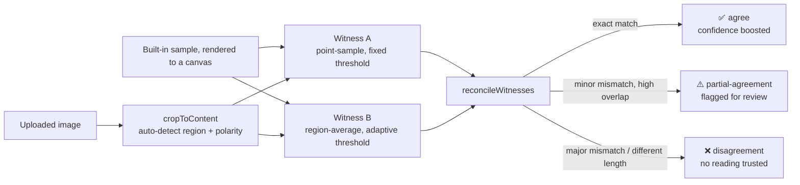

# OCR Dual-Witness Consensus Engine

A single OCR pass quietly misreads things — a `7` merged into a `1`, a heading mistaken for body
text — with no signal that anything went wrong. This demo runs **two independently-configured OCR
passes** on every image and only trusts a reading when both agree; disagreement gets flagged for a
human instead of silently returned as fact. It has two modes:

1. **Meter reading** — a purpose-built 7-segment digit decoder, pure pixel math, zero dependencies.
2. **Document / UI (general OCR)** — real text extraction via [Tesseract.js](https://github.com/naptha/tesseract.js)
   (open-source, runs client-side), with the extracted layout turned into Markdown by a
   geometry-based heuristic, not a model.

No AI vision API, no server, no API key, no cost in either mode — see [Design notes](#design-notes)
for why an earlier version that called a vision LLM was scrapped, and why mode 2 reaches for a
real OCR library instead of going back to one.

This is a clean-room reimplementation of the *dual-witness consensus* pattern used in production
in [Unyna](https://unyna.unyhub.org) (a LINE health assistant that reads medical meter displays).
No code, data, or real health readings from that codebase were used — every algorithm here was
written from scratch, and the sample "meters" are procedurally generated SVGs, not photos.

## Mode 1: Meter reading (7-segment) — how it works



Both witnesses run the exact same decoding pipeline — scan left to right, at each cursor position
sample the seven fixed segment locations of a 7-segment cell, threshold each sample to on/off, and
look up the resulting pattern against a digit table — but they differ in *how* they sample:

| | Witness A | Witness B |
|---|---|---|
| Sampling | single pixel at each segment's center | 3×3 grid averaged across each segment |
| Threshold | fixed constant (128) | per-image: midpoint of the darkest and brightest pixels sampled |

Single-pixel sampling is fast but fragile — one dimmed or noisy pixel flips a whole segment's
verdict. Region-averaging is more expensive but absorbs exactly that kind of localized noise or
blur, and the adaptive threshold recalibrates to each image's own brightness range instead of
assuming fixed lighting (useful against the glare sample, which raises the whole frame's
baseline brightness). [`imageDecoder.test.ts`](src/lib/imageDecoder.test.ts) has a test that dims
one exact pixel and shows Witness A misreading it while Witness B doesn't — the two witnesses are
genuinely independent, not just two calls that happen to differ in a name.

Their raw readings are reconciled by a pure function, [`reconcileWitnesses`](src/lib/consensus.ts):

- **Exact match** → `agree`, confidence gets boosted (capped at 0.99 — two witnesses agreeing is
  strong evidence, never treated as certainty).
- **Same length, mostly matching characters** (≥75% by default) → `partial-agreement`. The
  higher-confidence witness's reading is surfaced, but always flagged `needsHumanReview`.
- **Different lengths, or too many mismatched characters** → `disagreement`. No reading is
  returned — better to say "unresolved" than guess.

## Try it

Live demo: _(add your Vercel URL after deploying)_

1. Pick one of three procedurally-generated sample displays (clean / glare / blurry) — each
   rendered live as inline SVG, no image assets committed — or upload your own image.
2. Click **Analyze**. The image is rasterized to a canvas and decoded twice, entirely client-side —
   open the network tab, there's nothing to see.
3. See both witnesses' raw readings and the reconciled consensus, color-coded by status.

### Uploading your own image

The built-in samples use a known, fixed digit layout — the decoder can assume exactly where each
segment is. An uploaded image doesn't come with that guarantee, so the upload path runs an extra
calibration step first: [`cropToContent`](src/lib/cropToContent.ts) finds the bounding box of the
"display" against its background and detects whether it's light digits on dark (like the samples)
or dark digits on light (like most real LCDs), then
[`decodeDisplayAutoAlign`](src/lib/imageDecoder.ts) searches a small grid of plausible scale and
offset corrections and keeps whichever decode has the fewest unrecognized characters. This is
disclosed as **experimental** in the UI: the underlying segment decoder is tuned to this demo's
own generated proportions, so a photo of real hardware (different segment width/height ratios,
skew, uneven lighting) will often decode incorrectly or partially — that's an expected limitation
of a purpose-built decoder, not a bug. It's still a genuine test of the whole pipeline end to end,
including a case where the two witnesses land on different answers: on one hand-built test photo
(dark digits on a light background, reading `42.8`), Witness B decoded it exactly right while
Witness A read `42....` — the system correctly reported `disagreement` and flagged it for review
instead of picking one and asserting it as fact.

## Mode 2: Document / UI (general OCR) — how it works

The meter decoder only works because it knows exactly where every segment is. A screenshot or
photo of arbitrary text comes with no such guarantee, so this mode reaches for a real OCR engine —
[Tesseract.js](https://github.com/naptha/tesseract.js), a WASM build of Tesseract that runs
entirely in the browser. Two witnesses run the *same* engine with two different page-segmentation
strategies:

| | Witness A | Witness B |
|---|---|---|
| Page segmentation | `AUTO` — Tesseract finds its own text blocks | `SPARSE_TEXT` — treats the image as scattered, unstructured text |

On a clean single-column document the two usually agree closely. On a busy UI screenshot (icons,
short disconnected labels, mixed layouts) they often diverge — which is exactly the case worth
flagging rather than silently picking one.

Because OCR output is a passage of text, not a short digit string, agreement can't be judged
character-by-character the way the meter reader does (one dropped word would shift every following
index). [`textConsensus.ts`](src/lib/textConsensus.ts) instead computes normalized Levenshtein
similarity between the two witnesses' text and applies the same three-way
agree/partial-agreement/disagreement split as [`consensus.ts`](src/lib/consensus.ts), just on a
similarity ratio instead of an exact match.

**Markdown is generated mechanically, not by a model.** [`formatAsMarkdown.ts`](src/lib/formatAsMarkdown.ts)
takes Tesseract's own per-line bounding boxes, computes the page's median line height, and
classifies each line by how tall it is relative to that median (much taller → `#`, moderately
taller → `##`, a leading bullet glyph → a list item, everything else → paragraph text merged with
its neighbors when the vertical gap is small). It's a layout heuristic, not document understanding,
and it will misjudge unusual layouts — that's disclosed in the UI, not hidden.

**Verified with a real, non-synthetic OCR pass** (not just unit tests against fixed geometry): a
700×400px test image with a title, two body sentences, a subheading, and a 3-item bullet list was
rendered, uploaded through the real UI, and analyzed by both witnesses live:

| | Witness A (AUTO) | Witness B (SPARSE_TEXT) |
|---|---|---|
| Confidence | 90% | 91% |
| Extracted text | matches source, missing one trailing period | matches source exactly |

Result: `partial-agreement`, 98% similarity, 89% confidence, flagged for human review — the one
character difference (a missing `.`) was real and correctly caught. The resolved Markdown output
correctly rendered the title as `# Invoice Summary` and each bullet as its own `- ` list item; the
22px subheading did *not* cross the `##` threshold on this particular short page (its height ratio
against a median pulled up by the much larger title landed just under the cutoff) — a real,
disclosed limitation of a two-line-sample heuristic, not a hidden failure.

**What this mode costs that mode 1 doesn't:** Tesseract.js downloads its language model files
(English + Thai, a few MB total) from a public CDN (jsdelivr) on first use. Still no API key, no
account, no company money spent — a one-time, unauthenticated file fetch, not a metered API call.

## Run it yourself

```bash
git clone https://github.com/Shuumei/ocr-dual-witness-pipeline.git
cd ocr-dual-witness-pipeline
npm install
npm run dev
```

Open [http://localhost:3000](http://localhost:3000). No environment variables, no API key, no
account to sign up for — the whole app is static.

## Tests

The sampling/thresholding strategies and both consensus/confidence-gating modules are pure
functions, unit-tested against synthetic inputs with a known ground truth — the expected output
isn't a guess, it's exactly what was constructed:

```
npm run test

 ✓ src/lib/consensus.test.ts       (8 tests)
 ✓ src/lib/cropToContent.test.ts   (3 tests)
 ✓ src/lib/imageDecoder.test.ts    (10 tests)
 ✓ src/lib/textConsensus.test.ts   (9 tests)
 ✓ src/lib/formatAsMarkdown.test.ts (7 tests)

 Test Files  5 passed (5)
      Tests  37 passed (37)
```

`imageDecoder.test.ts` covers: every digit 0-9 decoded correctly under both sampling strategies, a
decimal point decoded in context, decoding stopping cleanly at the end of content instead of
inventing trailing digits, a blank image returning zero confidence, the single-dimmed-pixel case
where the two witnesses provably disagree, and `decodeDisplayAutoAlign` recovering a reading from
a shifted/rescaled image that the plain decoder misses. `cropToContent.test.ts` covers: detecting
a light-on-dark region, a dark-on-light region, and returning nothing for a flat image with no
contrast. `consensus.test.ts` covers: exact-match agreement with confidence boost (capped at
0.99), the classic single-digit 7-vs-1 misread as partial agreement, full disagreement,
mismatched-length readings, empty readings, and a custom threshold. `textConsensus.test.ts` covers
the Levenshtein-similarity equivalent: identical text, a single-typo near-match, unrelated text,
an empty reading, and a custom threshold. `formatAsMarkdown.test.ts` covers: empty/blank input,
a much-taller line as `#`, a moderately-taller line as `##`, bullet-glyph stripping into `- `
items, merging close paragraph lines, splitting on a larger vertical gap, and blank lines not
skewing the median line height.

Tesseract.js itself (the OCR engine in mode 2) isn't unit-tested — it's a third-party WASM binary,
not code this repo owns — but the mode was verified end-to-end through the real UI with a real
OCR pass; see the table in [Mode 2](#mode-2-document--ui-general-ocr--how-it-works) above.

Manually verified against all three samples (clean/glare/blurry) through the real UI — every
reading decoded correctly and both witnesses agreed:

| Sample | Ground truth | Witness A | Witness B | Consensus |
|---|---|---|---|---|
| Clean | `42.8` | `42.8` (44% conf.) | `42.8` (63% conf.) | agree, `42.8`, 73% |
| Glare | `178.2` | `178.2` (56% conf.) | `178.2` (62% conf.) | agree, `178.2`, 72% |
| Blurry | `905.1` | `905.1` (48% conf.) | `905.1` (58% conf.) | agree, `905.1`, 68% |

## Tech stack

- Next.js 16 (App Router) + TypeScript + Tailwind CSS — fully static, no server-side code
- [Tesseract.js](https://github.com/naptha/tesseract.js) for general text OCR (mode 2 only) —
  open-source, runs client-side, no API key
- Vitest for unit tests
- Deployed on Vercel (static export, free tier)

## Design notes

- **Why this isn't calling a vision LLM — in either mode.** An earlier version of mode 1 sent the
  rendered image to the Anthropic API instead of decoding pixels directly. It got shelved for three
  concrete reasons, in order of how much they mattered: (1) it needed a paid API key, and there was
  no way to hand a public portfolio demo a key without either exposing it to unbounded cost from
  anyone who visits and clicks, or gating it behind auth that defeats the point of a demo — this
  stopped being hypothetical when testing against a real key turned out to be spending a company's
  money on a personal project, not the developer's own; (2) it made the "measured, not guessed"
  numbers in this README dependent on a third-party model's behavior on a given day, instead of on
  code anyone can read and re-run; (3) `claude-haiku-4-5` — the "cheap witness" in that version's
  pairing — returned an empty reading 100% of the time on this synthetic font. When mode 2 (general
  OCR) was added later, the same constraints applied and pointed at the same answer: reach for a
  real, open-source, client-side OCR *library* (Tesseract.js) rather than a hosted vision model, so
  a general-purpose second mode doesn't reintroduce the exact cost and ownership problem mode 1 was
  built to avoid. Mode 1's decode pipeline is plain pixel math, free, deterministic, and inspectable
  end to end in [`imageDecoder.ts`](src/lib/imageDecoder.ts).
- **Known limitation: agreement isn't proof.** Both witnesses decode the *same* rendered image
  with the *same* segment geometry — a systematic error in that geometry, or a genuinely ambiguous
  pixel pattern, could fool both sampling strategies the same way. What they don't share is
  sensitivity to *localized* noise (single-pixel dimming, small artifacts), which is exactly the
  failure mode the `imageDecoder.test.ts` dimmed-pixel test demonstrates one witness catching and
  the other missing.
- **Fixed-grid assumption, worked around for uploads.** The core decoder assumes a calibrated,
  known cell pitch — the same geometry constants
  ([`sevenSegmentGeometry.ts`](src/lib/sevenSegmentGeometry.ts)) the renderer used to draw the
  image, which is exactly how real single-purpose meter-reading cameras work (fixed mount,
  calibrated ROI). The upload path (`cropToContent` + `decodeDisplayAutoAlign`) is a best-effort
  search around that assumption, not a real digit-localization model — it recovers scale and
  position errors but not skew, curved surfaces, or a genuinely different segment font. Treat it as
  a demonstration of the pipeline working end to end on real input, not a general OCR claim.
- **Sample images are generated, not photographed.**
  [`SevenSegmentDisplay.tsx`](src/components/SevenSegmentDisplay.tsx) draws a real 7-segment digit
  layout as SVG rectangles and applies an SVG blur/glare filter for the degraded samples — no
  external image files, no real hardware, no health data.
