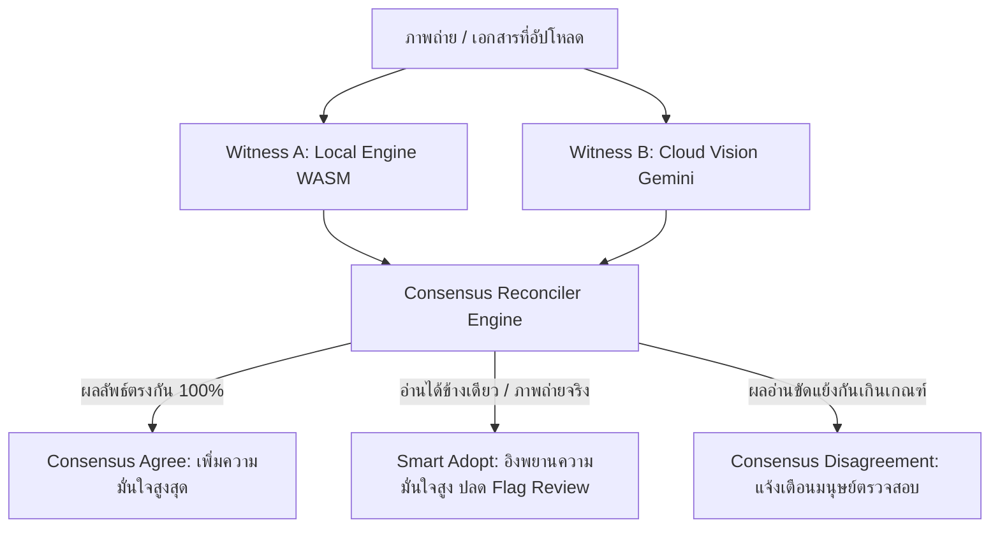

# OCR Dual-Witness Consensus Engine

[](https://nextjs.org/)
[](https://react.dev/)
[](https://www.typescriptlang.org/)
[](https://ui.shadcn.com/)
[](https://vitest.dev/)
[](LICENSE)

> **ระบบตรวจสอบเอกสารและมิเตอร์ดิจิทัลสองชั้น (Dual-Witness Consensus Engine)** พร้อมผสานพลัง **Local WASM Engine** (ประมวลผลในเบราว์เซอร์ 100%) ร่วมกับ **Google Gemini Vision AI** เพื่อตรวจสอบความสอดคล้องของผลลัพธ์ ป้องกันความผิดพลาดของ OCR รอบเดียว (Single-Pass OCR) และยกระดับความแม่นยำสูงสุด

---

## 🌟 จุดเด่นและฟีเจอร์หลัก (Key Features)

### 1. 📟 Meter Reading & Medical Display Engine (เครื่องวัดดิจิทัลและการแพทย์)
- **เครื่องวัดน้ำตาลในเลือด (Blood Glucose Meter)**:
  - สกัดค่าระดับน้ำตาล (เช่น `106 mg/dL` หรือ `mmol/L`) และวันเวลาที่บันทึกบนหน้าจอ
  - ประเมินผลอัตโนมัติตามเกณฑ์สากล **ADA Guideline (American Diabetes Association)** (ปกติก่อนอาหาร / เสี่ยงเบาหวาน / สูง)
- **เครื่องวัดความดันโลหิต (Blood Pressure Monitor)**:
  - สกัดค่า SYS (ความดันตัวบน), DIA (ความดันตัวล่าง) และ PULSE (อัตราการเต้นของหัวใจ)
  - ประเมินผลสุขภาพหัวใจตามเกณฑ์ **AHA Guideline (American Heart Association)**
- **มิเตอร์ดิจิทัลทั่วไปและตัวเลข 7-Segment (Utility & Counter)**:
  - Heuristic deterministic pixel-sampling พร้อมตารางถอดรหัส Segment ในเบราว์เซอร์
- **ระบบจัดตำแหน่งและตัดภาพแบบ 100% User-Controlled**:
  - Interactive Drag-to-Crop & ROI Selection พร้อมพรีวิวแบบเรียลไทม์
  - ปุ่ม Preset หน้าปัดอุปกรณ์ (เครื่องวัดความดัน, เครื่องวัดน้ำตาล, Center LCD, เต็มรูป)
  - เครื่องมือหมุนภาพด้วยตนเอง (`-90°`, `+90°`, `-5°`, `+5°`, `Reset 0°` และ Fine Angle Slider) ปราศจากการหมุนอัตโนมัติที่ทำให้ภาพคลาดเคลื่อน

---

### 2. 📑 Document OCR & Thai Semantic Intelligence (สกัดข้อความและเอกสารภาษาไทย)
- **ระบบจัดระเบียบโครงสร้างเอกสารและ Markdown ชั้นสูง**:
  - วิเคราะห์และจำแนกประเภทเอกสารอัตโนมัติ (Document Classification):
    - 🧾 **สลิปโอนเงินธนาคาร (`bank_slip`)**: ธนาคารต้นทาง/ปลายทาง, จำนวนเงิน, วันเวลา, ผู้โอน, ผู้รับ, เลขอ้างอิงธุรกรรม
    - 🛒 **ใบเสร็จรับเงิน / ใบกำกับภาษี (`receipt_invoice`)**: ชื่อสถานประกอบการ, เลขประจำตัวผู้เสียภาษี 13 หลัก, ตารางรายการสินค้าพร้อมจำนวนและราคา, Subtotal, VAT 7%, ยอดรวมสุทธิ
    - 🪪 **บัตรประชาชน / เอกสารยืนยันตัวตน (`id_card`)**: เลขประจำตัวประชาชน 13 หลัก, ชื่อ-นามสกุล (TH/EN), วันเกิด, ที่อยู่, วันหมดอายุ
    - 🏥 **เอกสารทางการแพทย์ / ผลตรวจแล็บ (`medical_document`)**: ข้อมูลคนไข้, สถานพยาบาล, ค่าผลการตรวจวิเคราะห์
    - 📜 **หนังสือราชการ / สัญญา / ข้อตกลง (`official_contract`)**: ชื่อเรื่อง, คู่สัญญา, วันที่บังคับใช้, ข้อความสำคัญ
    - 📄 **เอกสารทั่วไป / รายงาน (`general_document`)**
- **แก้ปัญหาสระลอยภาษาไทย (Thai Floating Vowel & Tone Normalizer)**:
  - จัดระเบียบวรรณยุกต์ซ้อน สระบน-ล่างให้ถูกต้องตามหลักไวยากรณ์ภาษาไทย
- **Markdown Document Output**:
  - สรุปผลลัพธ์เป็นโครงสร้าง Markdown สวยงาม รองรับ Callout (`> ...`), Dividers (`---`), ตาราง Markdown Table และ Key-Value Split
  - รองรับการ Export เป็นไฟล์ `.md` หรือคัดลอกลงคลิปบอร์ดได้ทันที

---

### 3. ⚖️ สถาปัตยกรรมฉันทามติสองพยาน (Dual-Witness Consensus Architecture)



- **Dual-Witness Hybrid (แนะนำ)**: ตรวจสอบความสอดคล้องระหว่าง Local WASM กับ Cloud Vision AI
- **Cloud Vision Only (AI-Only)**: ประมวลผลผ่าน Gemini Vision API โดยตรง เหมาะสำหรับภาพถ่ายจริงที่มีมุมเอียงหรือสภาพแสงซับซ้อน
- **Local WASM Only**: ทำงานแบบ Offline ในเครื่อง 100% เหมาะสำหรับภาพสังเคราะห์และเอกสารทั่วไป

---

### 4. 🔑 ปรับแต่งโมเดล Gemini และความปลอดภัย (BYOK & Privacy First)
- **Dynamic Model Selection**: เลือกโมเดลที่ต้องการใช้งานได้อย่างอิสระในหน้าการตั้งค่า (Settings):
  - `gemini-2.5-flash-lite` (เร็ว ประหยัดโควต้า แนะนำสำหรับการใช้งานทั่วไป)
  - `gemini-2.5-flash` (สมดุลระหว่างความเร็วและความแม่นยำ)
  - `gemini-2.5-pro` (ความแม่นยำสูงสุดสำหรับเอกสารซับซ้อน)
  - `Custom Model Name` (ระบุชื่อโมเดลเฉพาะเจาะจงได้เอง)
- **Bring Your Own Key (BYOK)**: API Key ถูกบันทึกไว้ใน `localStorage` ของเบราว์เซอร์ผู้ใช้เท่านั้น ไม่มีการเก็บลงฐานข้อมูลหรือเซิร์ฟเวอร์
- **API Key Enforcement**: แสดงแถบแจ้งเตือนและระบบล็อกปุ่มอัตโนมัติเมื่อตรวจพบการอัปโหลดภาพจริงที่ต้องพึ่งพา AI ความแม่นยำสูง

---

## 🛠️ เทคโนโลยีที่ใช้ (Tech Stack)

- **Frontend & App Router**: [Next.js 16 (Turbopack)](https://nextjs.org/), [React 19](https://react.dev/), [TypeScript](https://www.typescriptlang.org/)
- **UI & Styling**: [shadcn/ui](https://ui.shadcn.com/) (Card, Button, Badge, Dialog, Tabs, Separator, Skeleton, StepProgress), [Tailwind CSS](https://tailwindcss.com/), [Lucide React](https://lucide.dev/)
- **OCR Engines**:
  - Client-Side: [Tesseract.js](https://github.com/naptha/tesseract.js) (WebAssembly) & Custom 7-Segment Heuristic Decoder
  - Cloud AI: Google Gemini Vision API (Multimodal Structured Intelligence)
- **Unit Testing**: [Vitest](https://vitest.dev/) (56 Unit Tests ครอบคลุม 9 โมดูล)

---

## 🚀 การติดตั้งและเริ่มใช้งาน (Getting Started)

### ความต้องการของระบบ:
- Node.js 18.17 หรือใหม่กว่า
- เบราว์เซอร์สมัยใหม่ (Chrome, Edge, Firefox, Safari)

### 1. โคลนคลังโค้ดและติดตั้ง Dependencies
```bash
git clone https://github.com/Shuumei/ocr-dual-witness-pipeline.git
cd ocr-dual-witness-pipeline
npm install
```

### 2. กำหนดค่าสภาพแวดล้อม (ทางเลือก)
สร้างไฟล์ `.env.local` สำหรับกำหนด Default Model หรือ API Key ระดับเซิร์ฟเวอร์:
```env
GEMINI_API_KEY=your_gemini_api_key_here
GEMINI_MODEL=gemini-2.5-flash-lite
```
*(หมายเหตุ: ผู้ใช้สามารถกรอก Gemini API Key ผ่านปุ่ม **Engine Settings** บนหน้าเว็บได้โดยตรงโดยไม่ต้องตั้งค่าในไฟล์)*

### 3. รันโปรเจกต์ในโหมด Development
```bash
npm run dev
```
เปิดเบราว์เซอร์ไปที่ [http://localhost:3000](http://localhost:3000)

---

## 🧪 การทดสอบระบบ (Test Suite & Verification)

โปรเจกต์มีชุดทดสอบอัตโนมัติครอบคลุมทั้งการคำนวณฉันทามติ, การตัดสระลอยไทย, การสกัดเอกสาร, และตัวถอดรหัสภาพ:

```bash
# รัน Unit Tests ทั้งหมด
npm test

# ตรวจสอบรูปแบบโค้ด (Linting)
npm run lint

# ทดสอบคอมไพล์ Production Build
npm run build
```

ผลการทดสอบ:
```text
 ✓ src/lib/autoDeskew.test.ts           (3 tests)
 ✓ src/lib/thaiTextNormalizer.test.ts   (7 tests)
 ✓ src/lib/cropToContent.test.ts        (3 tests)
 ✓ src/lib/consensus.test.ts            (8 tests)
 ✓ src/lib/textConsensus.test.ts        (9 tests)
 ✓ src/lib/formatAsMarkdown.test.ts     (7 tests)
 ✓ src/lib/documentIntelligence.test.ts (5 tests)
 ✓ src/lib/meterOcr.test.ts             (4 tests)
 ✓ src/lib/imageDecoder.test.ts         (10 tests)

 Test Files  9 passed (9)
      Tests  56 passed (56)
```

---

## 📄 ข้อตกลงสิทธิ์การใช้งาน (License)

โปรเจกต์นี้เผยแพร่ภายใต้สัญญาอนุญาต [MIT License](LICENSE)
