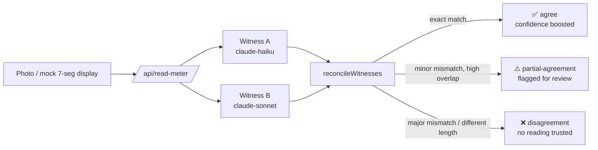

# OCR Dual-Witness Consensus Engine

Reading a 7-segment digit off a low-quality photo (glare, blur, bad angle) is exactly where a single
vision model call quietly hallucinates a digit — a `7` misread as `1`, a `8` misread as `0` — with no
signal that anything went wrong. This demo cross-checks every reading against a second, independent
model call and only trusts the result when both witnesses agree; disagreement gets flagged for a
human instead of silently returned as fact.

This is a clean-room reimplementation of the *dual-witness consensus* pattern used in production in
[Unyna](https://unyna.unyhub.org) (a LINE health assistant that reads medical meter displays). No
code, data, or real health readings from that codebase were used — the consensus algorithm here was
written from scratch, and the sample "meters" are procedurally generated SVGs, not photos.

## How it works



Two vision models (a cheap/fast one and a stronger one) independently read the same image. Their raw
readings are reconciled by a pure function, [`reconcileWitnesses`](src/lib/consensus.ts):

- **Exact match** → `agree`, confidence gets boosted (capped at 0.99 — two witnesses agreeing is
  strong evidence, never treated as certainty).
- **Same length, mostly matching characters** (≥75% by default) → `partial-agreement`. The
  higher-confidence witness's reading is surfaced, but always flagged `needsHumanReview`.
- **Different lengths, or too many mismatched characters** → `disagreement`. No reading is returned —
  better to say "unresolved" than guess.

## Try it

Live demo: _(add your Vercel URL after deploying)_

1. Pick one of three procedurally-generated sample displays (clean / glare / blurry) — each rendered
   live as inline SVG, no image assets committed — or upload your own photo of any digital display.
2. Click **Analyze**. The image is sent to a Next.js API route, never directly to the LLM from the
   browser (the API key never touches the client).
3. See both witnesses' raw readings and the reconciled consensus, color-coded by status.

## Run it yourself

```bash
git clone https://github.com/Shuumei/ocr-dual-witness-pipeline.git
cd ocr-dual-witness-pipeline
npm install
cp .env.example .env.local   # add your own ANTHROPIC_API_KEY
npm run dev
```

Open [http://localhost:3000](http://localhost:3000). Without an API key, the sample UI still renders
and `npm run test` still runs — the consensus logic itself has no external dependency.

## Tests

The consensus/confidence-gating logic and the vision-response parser are pure functions, unit-tested
independently of any network call:

```
npm run test

 ✓ src/lib/consensus.test.ts  (8 tests)
 ✓ src/lib/witness.test.ts    (5 tests)

 Test Files  2 passed (2)
      Tests  13 passed (13)
```

Covers: exact-match agreement with confidence boost (capped at 0.99), the classic single-digit
7-vs-1 misread as partial agreement, full disagreement, mismatched-length readings, empty readings,
a custom threshold, and malformed/markdown-wrapped model output.

## Tech stack

- Next.js 16 (App Router) + TypeScript + Tailwind CSS
- Anthropic SDK (`@anthropic-ai/sdk`) — two witness calls per request, server-side only
- Vitest for unit tests
- Deployed on Vercel

## Design notes

- **No client-side API key.** All vision calls happen in `src/app/api/read-meter/route.ts`, a
  server-only Next.js route.
- **Two different models, not one model called twice**, so the witnesses have genuinely independent
  failure modes rather than the same model repeating its own mistake.
- **Sample images are generated, not photographed.** `src/components/SevenSegmentDisplay.tsx` draws a
  real 7-segment digit layout as SVG rectangles and applies an SVG blur/glare filter for the degraded
  samples — no external image files, no real hardware, no health data.
